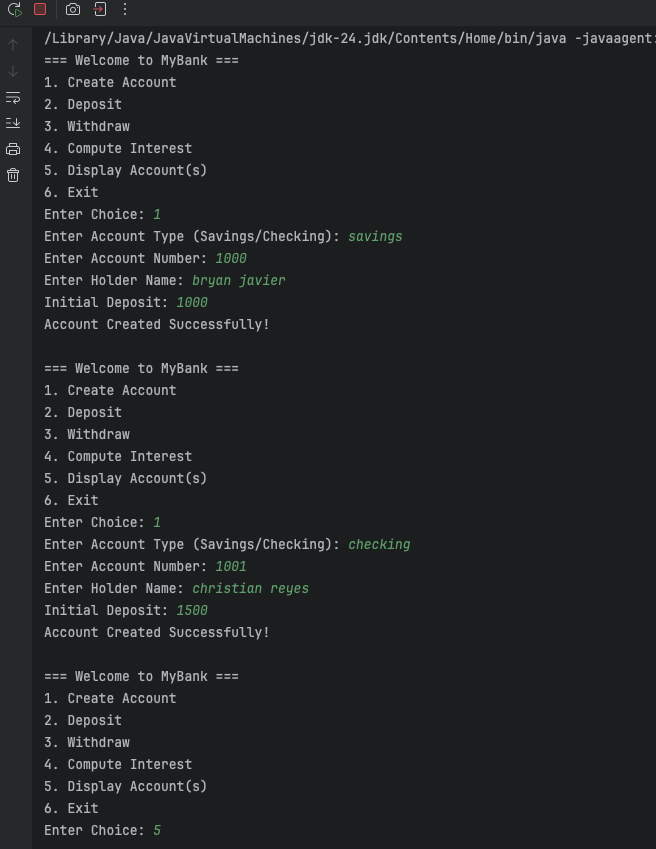
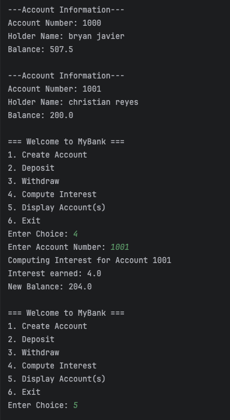

<b>Name: </b>Bryan Christian S. Javier
 

<b>Project Title: </b>TU-Java-Session2-OOP-UnitTesting
 

<b>Screenshot of Output</b>

<b>Program Execution:</b>
 

<b>Unit Testing:</b>

<b>Savings Class</b>
 

<b>Checking Class</b>
 

